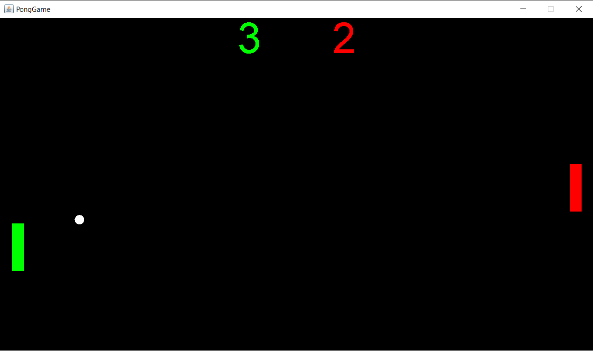
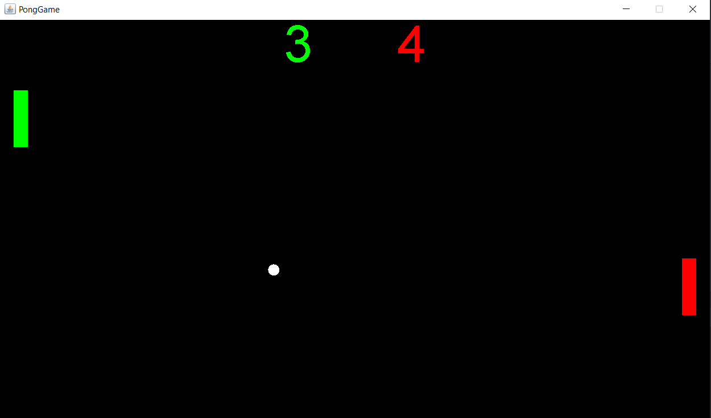

# PongGame
Modern programing platforms course project. The project is a simple pong game for one player with an AI opponent. The game utilizes multiple threads. Each element on the board (player paddle, AI paddle, ball) runs on a separate thread.

## Built with
* [JetBrains IntelliJ IDEA](https://www.jetbrains.com/idea/)
* [Sourcetree](https://www.sourcetreeapp.com/)

## Screenshots
 

